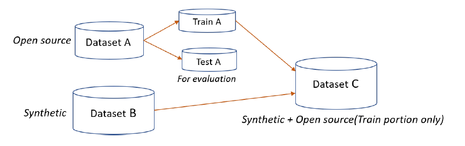

##Fine-tune LLM for Language Translatio

In this project I fine-tune an LLM for language translation from
German to French.

#### Design Constraints:
- First, I selected a open source dataset with pairs of inputs for the German - French language translation (Atleast 1000 pairs).
- The model selected for finetuning should have atleast 1B parameters in size. 

#### Design decisions
- Deciding the suitable split ratio between the training [Dataset A: Train] and testing [Dataset A: Test] datasets in the benchmark dataset.
- Choosing a metric for evaluation:
BlEU score metric was selected for evaluation

#### Implementation Phase
1. Load [Dataset A] and split it according to the designed ratio.  
2. Load your chosen pre-trained model [Model A].  
3. Evaluate [Model A] on the test dataset [Dataset A: Test] using the chosen metric.  
4. Fine-tune [Model A] on the training dataset [Dataset A: Train] to create [Model B].  
5. Evaluate [Model B] on the test dataset [Dataset A: Test] using the chosen metric.  
6. Use the designed prompt to generate a new synthesized dataset [Dataset B], twice the size of the training set [Dataset A: Train], using the selected larger model.  
7. Fine-tune [Model A] on the synthesized dataset [Dataset B] to create [Model C].  
8. Evaluate [Model C] on the test dataset [Dataset A: Test] using the chosen metric.  
9. Combine [Dataset A: Train] and [Dataset B], shuffle them with suitable seeds, and create [Dataset C].  
10. Fine-tune [Model A] on the combined dataset [Dataset C] to create [Model D].  
11. Evaluate [Model D] on the test dataset [Dataset A: Test] using the chosen metric.  
12. Plot the performance of all models using appropriate visualizations.  

The figure below illustrates how the datasets are used in this project

